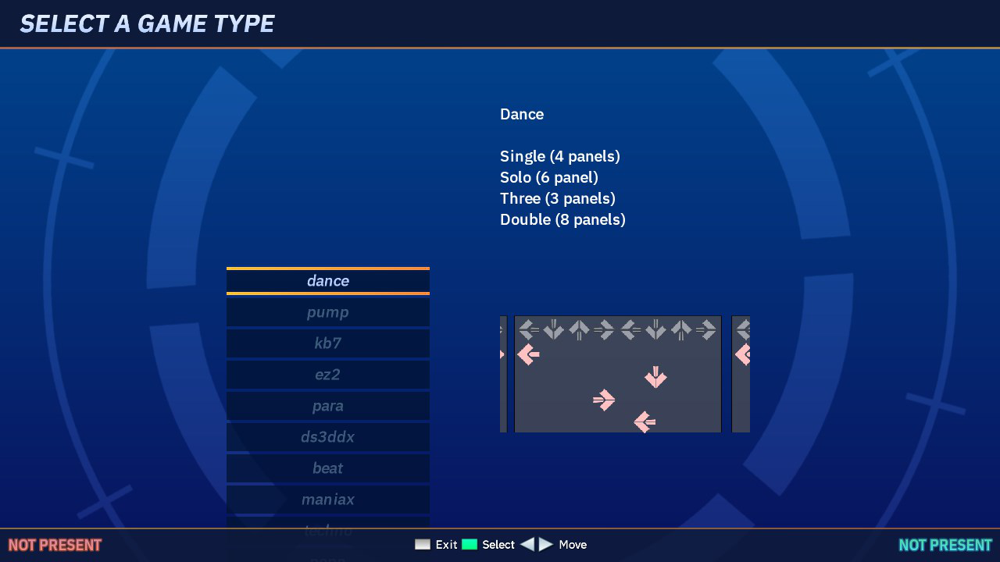

# Game types
Project OutFox supports a variety of game types, which simulate different types of rhythm games (including button layouts and, where applicable, gameplay behaviours specific to the game type). Game types are further divided into **styles**, which define chart types such as single, double, etc.

As of Alpha 4.9.7, they include:

* **dance** - the default game type. Similar to games such as _Dance Dance Revolution_ and _In the Groove_, it uses four lanes designated by cardinal directions (left, down, up, right).
* **pump** - A five-lane dance game, which uses four diagional directions and the center rather than cardinal directions.
* **kb7** - A seven-lane game type similar to games such as _O2Jam_, with six keys flanking a centre column (usually mapped by default to the SDF, JKL, and space keys by default)
* **ez2** - A game type based on the defunct arcade game _EZ2Dancer_, which uses three foot panels and a pair of hand sensors.
* **para** - A dance game designed for _para para_ routines, which is typically played with five infrared hand sensors in a semicircular layout, and uses a considerably looser scoring system.
* **ds3ddx** - A dance game whose format is common among Chinese arcade dance games, which uses four diagional foot panels, and four hand sensors around the pad in the cardinal directions.
* **beat** - A BMS player mode, supporting 5-key and 7-key styles, and the ability to load BMS files.
* **maniax** - A game type based on the defunct arcade game _Dance Maniax_, which uses four hand sensors arranged into two columns (upper and lower).
* **techno** - Similar to ``dance``, except supporting up to eight panels (cardinal and diagional directions)
* **popn** - A PMS player mode, supporting 5-button and 9-button styles, and the ability to load PMS files.
* **gddm** - A drum mode supporting five-drum (with one bass pedal) and seven-drums (two pedals) styles, modelled upon the mechanics of the arcade rhythm game _DrumMania_.
* **guitar** - A guitar mode supporting three-button and five-button game types, modelled upon the mechanics of the arcade rhythm game _Guitar Freaks_.
* **kickbox** - A mode that was originally designed for an exercise setup.