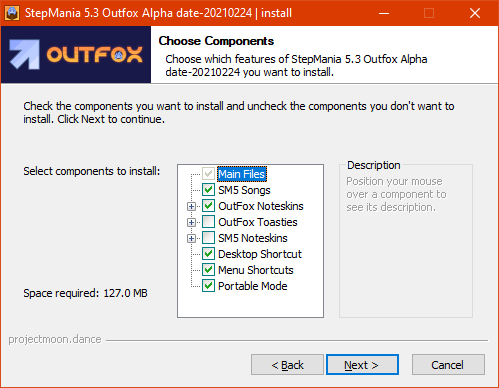

# Installation

## System requirements

Project OutFox has builds for Windows, macOS, and Linux. We also have specific builds for ARM-based Linux devices and Apple M1-based computers. It should run on just about any computer from the mid-2000s onward, depending on the operating system and hardware specifications. We have had alphas running on CPUs as old as the Pentium E2180.

The Windows build of Project OutFox requires Windows 7 or later. Windows XP builds are available for selected releases, which require Service Pack 3.

Parts of the game are so well-optimised now that they're running too fast, and the rest of the game needs to catch up. We will have a proper fix later, but increasing the amount of background activity (i.e. having other programs running in the background, etc.) is a temporary solution.

## How to install Project OutFox

Download the installer or package for your respective operating system on [the Project OutFox website](https://projectmoon.dance/downloads).

### Windows

Windows builds of Project OutFox use an installer; follow the instructions, and launch the game using the provided shortcuts. 

* It is recommended that you **do not** install it to the Program Files directory, as this is known to cause problems.
* The installer offers optional components, such as the noteskins that were included with StepMania 5.0.12 and 5.1, and "Toasties" - animations that can trigger on combo milestones in-game.
* By default, the game is installed in "Portable Mode"; save data is stored in the installation directory. If you disable portable mode, your save data will be stored in your user directory under ``%APPDATA%/StepMania 5.3``.

If your log file (Installation directory/Logs) shows WDDM1.0 or WDDM1.1 at the end of the graphics card name (i.e. "Intel(R) 82945G Express Chipset Family (Microsoft Corporation - WDDM 1.0)") or the log shows "Microsoft GDI" as the renderer, then you are running the OpenGL-crippled "Windows" driver that is downloaded on a fresh install. Project OutFox will not work on these drivers, as we do not support DirectX anymore (the old D3D renderer that 5.0.12/5.1 has) There is a list of drivers at [here](https://www.intel.com/content/www/us/en/support/articles/000005733/graphics.html) but for some of these cards, you need to keep your Windows 7 install disc handy!

### Linux

On Linux, we only provide pre-compiled binaries at this time. Extract the tarball, and run ``./stepmania`` in the directory. 

If you see an error mentioning that it could not find ``libOpenGL.so.0:``, install ``libopengl0`` from your distribution's package manager.

### macOS

Open the DMG file and drag the game to your Applications directory.

Until we produce a digitally-signed build, you will have to change macOS security settings in order for Project OutFox to operate correctly. macOS prevents access to external files by unsigned apps unless given manual permission by the user.

To do this, open Terminal and run the following command: ``xattr -dr com.apple.quarantine /path/to/outfox``, replacing ``/path/to/outfox`` with the path to the directory containing the OutFox executable (manually typing it out, or dragging the folder containing the game executable directly onto the window to fill it automatically).
If no errors show up after pressing enter, then you're ready to start the game.

On older builds, macOS Catalina also generated a message stating that the game was requesting permission to receive keystrokes from any application. This was a side effect of previous code that has since been removed.

## Next steps

Once Project OutFox is installed, you can move on to [setting the game up](./getting-started).